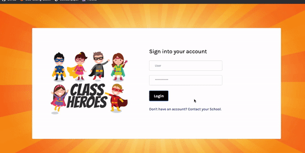
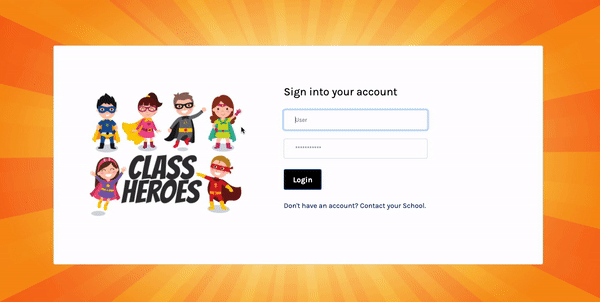

# Class Heroes!!

## Description
A webapp using API's to design and create an application that can be used in a classroom setting that allows kids to participate more fully through use of comic characters. It was important to make sure that the users can fulfill the Create, Read, Update, and Delete functionalities(C.R.U.D.). Students can now message their teachers if they need help or is stuck on an assignment. They will be able to update their emergency contacts, what they prefer to be called in class, and also update their feelings for the day. Teachers will be able to record students feelings data as well as emailing parents for any reasons. 

Heroku deployment: https://class-heros.herokuapp.com/

## Table of contents
- [Title](#Title)
- [Demo](#Demo)
- [Installation](#Installation)
- [Technologies](#Technologies)
- [Team](#Team)
- [Test](#Test)
- [License](#License)
- [Questions](#Questions?)

## Demo
- Students Demo:

- Teachers Demo: 

## Installation
To create this application, you would have to run `npm install` which will provide you a npm dependencies such as node_modules & package.json. However, if users only need to install package.json they can run `npm init -y` on the command-line. 
  - `inquirer` will capture user response in the command-line 
  - `mySQL2` a database management system
  - `animate.css` a package that can target a specific element to create a unique motion.
  - `bcryptjs` this allows that users to hash our their password when signing into the application
  - `sequelize` a promise-based ORM for Postgres, MySQL, MariaDB, SQLite and Microsoft SQL Server

## Technologies

 [Bootstrap](http://getbootstrap.com/) - Extensive list of components and  Bundled Javascript plugins.
 
 [Postman](https://www.postman.com/) - Simplify each step of building an API and streamline collaboration so you can create better APIs—faster.
 
 [Trello](https://trello.com/en-US) - Trello’s boards, lists, and cards enable teams to organize and prioritize projects in a fun, flexible, and rewarding way.
 
 [Lucid Chart](https://www.lucidchart.com/pages/) - Create powerful visuals to understand the teams, information and process.

 [MyWorkBench](https://www.mysql.com/products/workbench/) - Database that we used to run our SQLs to create tables and insert data. 

[VisualStudioCode](https://code.visualstudio.com/) - Text editor

## Team

[Christian Suchoski](https://github.com/Huski82) |[Kathleen Welch](https://github.com/ktywelch) |[Lea Wilhelmer](https://github.com/leawilhelmer) |[Victor Tran](https://github.com/Victortran415)

## License

MIT © [X-Force 4 Team](https://github.com/)

## Questions?

- Github: https://github.com/Victortran415

- Email: victortran415@gmail.com